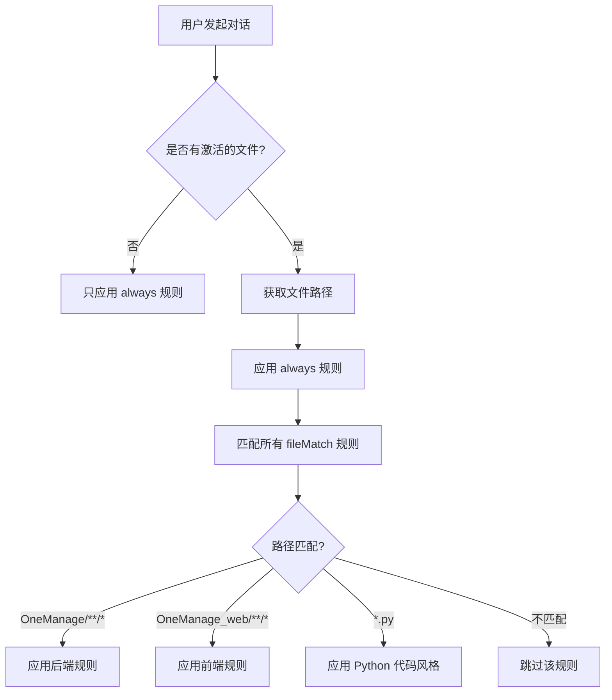

# Kiro Steering 规则应用机制指南

## 📖 概述

本文档详细说明 Kiro IDE 中 steering 规则的应用机制，帮助你理解：
- 规则如何被触发和应用
- 如何配置不同项目的规则
- 如何在前后端项目中使用不同的规范

## 🎯 核心概念

### 什么是 Steering 规则？

Steering 规则是存储在 `.kiro/steering/` 目录下的 Markdown 文件，用于指导 Kiro AI 助手的行为。这些规则定义了：
- 技术栈规范
- 代码风格
- 开发流程
- 最佳实践

### 规则的作用范围

Steering 规则通过文件开头的 **front-matter** 控制应用范围：

```markdown
---
inclusion: always | fileMatch | manual
fileMatchPattern: 'path/pattern/**/*'
---
```

## 📋 三种应用模式

### 1. Always 模式（始终应用）

```markdown
---
inclusion: always
---

# 这个规则会应用到所有对话和所有文件
```

**适用场景**:
- 通用的开发规范（如 `spec-conventions.md`）
- 工作流程规范（如 `development-workflow.md`）
- 项目管理规范（如 `task-management.md`）

**示例**:
```
.kiro/steering/
├── spec-conventions.md          (always)
├── development-workflow.md      (always)
└── task-management.md           (always)
```

### 2. FileMatch 模式（条件应用）

```markdown
---
inclusion: fileMatch
fileMatchPattern: 'OneManage/**/*'
---

# 只有当激活的文件匹配路径时才应用
```

**适用场景**:
- 特定项目的技术栈（如后端 vs 前端）
- 特定语言的代码风格（如 Python vs JavaScript）
- 特定模块的规范

**示例**:
```
.kiro/steering/
├── tech-stack.md                (fileMatch: 'OneManage/**/*')
├── frontend-tech-stack.md       (fileMatch: 'OneManage_web/**/*')
└── code-style.md                (fileMatch: '*.py')
```

### 3. Manual 模式（手动引用）

```markdown
---
inclusion: manual
---

# 需要用户手动通过 #steering 引用
```

**适用场景**:
- 可选的高级规范
- 特殊场景的指导
- 实验性的规则

## 🔍 规则匹配机制

### 基于激活的编辑器窗口

Kiro 根据 **当前激活的编辑器窗口** 中的文件路径来匹配 `fileMatchPattern`。

```
Kiro IDE 界面:
┌─────────────────────────────────────────────────────┐
│ Tab1: tasks.py  Tab2: imageGenerator.js  Tab3: ... │
│                      ▲                               │
│                   激活的标签                          │
├─────────────────────────────────────────────────────┤
│  [编辑器内容]                                         │
└─────────────────────────────────────────────────────┘
```

### 匹配流程



### 实际例子

#### 例子 1：激活后端文件
```
激活文件: OneManage/features/image_generator/services/preview/tasks.py

匹配检查:
  ✅ always 规则
  ✅ 'OneManage/**/*'  → tech-stack.md
  ✅ '*.py'            → code-style.md
  ❌ 'OneManage_web/**/*' → frontend-tech-stack.md

应用规则:
  ✅ spec-conventions.md (always)
  ✅ development-workflow.md (always)
  ✅ tech-stack.md (后端技术栈)
  ✅ code-style.md (Python 代码风格)
```

#### 例子 2：激活前端文件
```
激活文件: OneManage_web/src/components/PsdCanvasPreview.vue

匹配检查:
  ✅ always 规则
  ❌ 'OneManage/**/*'  → tech-stack.md
  ❌ '*.py'            → code-style.md
  ✅ 'OneManage_web/**/*' → frontend-tech-stack.md

应用规则:
  ✅ spec-conventions.md (always)
  ✅ development-workflow.md (always)
  ✅ frontend-tech-stack.md (前端技术栈)
```

#### 例子 3：纯对话（无激活文件）
```
没有激活文件

应用规则:
  ✅ spec-conventions.md (always)
  ✅ development-workflow.md (always)
  ❌ 所有 fileMatch 规则
```

## 🎨 当前项目的 Steering 配置

### 目录结构

```
coding/                          ← 工作区根目录
├── .kiro/                       ← Kiro 配置
│   ├── steering/                ← Steering 规则目录
│   │   ├── spec-conventions.md          (always)
│   │   ├── development-workflow.md      (always)
│   │   ├── task-management.md           (always)
│   │   ├── tech-stack.md                (fileMatch: OneManage/**/*)
│   │   ├── frontend-tech-stack.md       (fileMatch: OneManage_web/**/*)
│   │   ├── code-style.md                (fileMatch: *.py)
│   │   └── ...
│   ├── specs/                   ← Spec 文档
│   └── settings/                ← IDE 设置
├── OneManage/                   ← 后端项目 (Python/FastAPI)
├── OneManage_web/               ← 前端项目 (Vue3/Naive UI)
└── ...
```

### 规则应用矩阵

| 规则文件 | inclusion | fileMatchPattern | 应用时机 |
|---------|-----------|------------------|---------|
| `spec-conventions.md` | `always` | - | 所有对话 ✅ |
| `development-workflow.md` | `always` | - | 所有对话 ✅ |
| `task-management.md` | `always` | - | 所有对话 ✅ |
| `tech-stack.md` | `fileMatch` | `OneManage/**/*` | 后端文件 ✅ |
| `frontend-tech-stack.md` | `fileMatch` | `OneManage_web/**/*` | 前端文件 ✅ |
| `code-style.md` | `fileMatch` | `*.py` | Python 文件 ✅ |

## 🔧 配置和管理

### 查看当前应用的规则

在对话开始时，Kiro 会显示当前应用的规则：

```markdown
## Included Rules (tech-stack.md)
## Included Rules (code-style.md)
```

这告诉你：
- 当前激活的文件匹配了哪些规则
- Kiro 会遵循这些规范来回答问题

### vibe-config.json 的作用

`.kiro/settings/vibe-config.json` 文件配置 Kiro 的行为：

```json
{
  "vibeMode": {
    "applySteering": true,           // 是否启用 steering 规则
    "steeringRules": [               // UI 显示的规则列表
      "tech-stack",
      "code-style",
      "spec-conventions"
    ],
    "language": "zh-CN",             // 对话语言
    "codeCommentLanguage": "zh-CN"   // 代码注释语言
  }
}
```

**注意**: `steeringRules` 数组主要用于 UI 显示，**真正的应用控制是通过 front-matter**。

### 动态切换规则

当你在不同文件标签之间切换时，steering 规则会**自动更新**：

```
时间线:
10:00 - 打开 tasks.py (后端)
        → 应用后端规则 (TaskIQ + NATS)
        
10:05 - 切换到 PsdCanvasPreview.vue (前端)
        → 应用前端规则 (Vue3 + Composition API)
        
10:10 - 切换回 tasks.py (后端)
        → 重新应用后端规则
```

## 📝 最佳实践

### 1. 使用 fileMatch 分离前后端规则

```markdown
# tech-stack.md (后端)
---
inclusion: fileMatch
fileMatchPattern: 'OneManage/**/*'
---

# frontend-tech-stack.md (前端)
---
inclusion: fileMatch
fileMatchPattern: 'OneManage_web/**/*'
---
```

### 2. 通用规则使用 always

```markdown
# spec-conventions.md
---
inclusion: always
---

# 适用于所有项目的规范
```

### 3. 语言特定规则使用文件扩展名

```markdown
# code-style.md
---
inclusion: fileMatch
fileMatchPattern: '*.py'
---

# Python 代码风格规范
```

### 4. 可选规则使用 manual

```markdown
# advanced-optimization.md
---
inclusion: manual
---

# 高级性能优化指南
# 需要时通过 #steering 手动引用
```

## 🚀 添加新规则

### 步骤 1：创建规则文件

```bash
# 在 .kiro/steering/ 创建新文件
touch .kiro/steering/my-new-rule.md
```

### 步骤 2：添加 front-matter

```markdown
---
inclusion: fileMatch
fileMatchPattern: 'path/to/match/**/*'
---

# 我的新规则

规则内容...
```

### 步骤 3：测试规则

1. 打开匹配路径的文件
2. 开始对话
3. 检查是否显示 `## Included Rules (my-new-rule.md)`

## ❓ 常见问题

### Q1: 为什么我的规则没有被应用？

**检查清单**:
1. ✅ front-matter 格式是否正确？
2. ✅ fileMatchPattern 是否匹配当前文件？
3. ✅ 是否有激活的编辑器窗口？
4. ✅ applySteering 是否为 true？

### Q2: 可以同时应用多个规则吗？

**可以！** 一个文件可以匹配多个 fileMatchPattern。

例如 `OneManage/core/broker.py` 会同时应用：
- `tech-stack.md` (匹配 `OneManage/**/*`)
- `code-style.md` (匹配 `*.py`)

### Q3: 如何临时禁用某个规则？

**方法 1**: 修改 front-matter
```markdown
---
inclusion: manual  # 改为 manual 模式
---
```

**方法 2**: 修改 vibe-config.json
```json
{
  "vibeMode": {
    "applySteering": false  // 禁用所有 steering
  }
}
```

### Q4: fileMatchPattern 支持哪些模式？

支持 **glob 模式**:
- `**/*` - 匹配所有子目录
- `*.py` - 匹配所有 Python 文件
- `src/**/*.vue` - 匹配 src 下所有 Vue 文件
- `{OneManage,OneManage_web}/**/*` - 匹配多个目录

## 📚 相关资源

- [Spec 开发规范](.kiro/steering/spec-conventions.md)
- [开发流程策略](.kiro/steering/development-workflow.md)
- [后端技术栈](.kiro/steering/tech-stack.md)
- [前端技术栈](.kiro/steering/frontend-tech-stack.md)

---

**最后更新**: 2025-10-20
**维护者**: Kiro 工作区管理员
