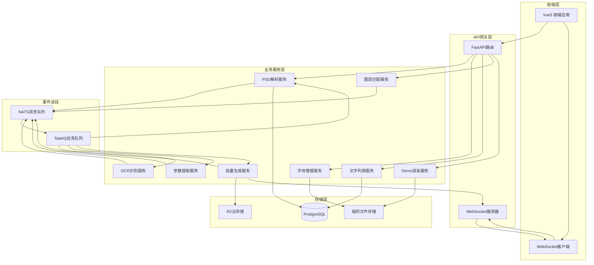
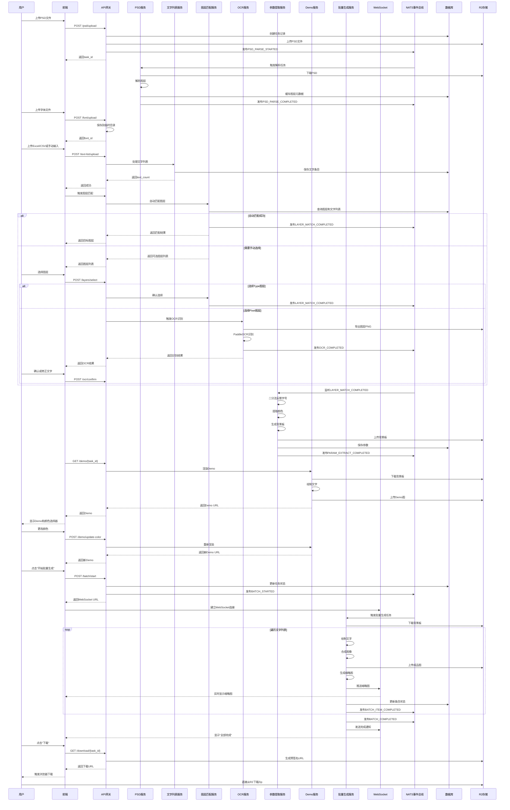

# 设计文档 - PSD批量换字工具

## 概览

本系统采用事件驱动架构，基于TaskIQ + NATS实现异步任务处理和实时通信。系统分为前端交互层、API网关层、业务服务层和存储层，通过WebSocket提供实时反馈，通过云存储实现高性能文件分发。

### 核心设计原则

1. **事件驱动**: 使用NATS进行模块间解耦通信
2. **异步优先**: 长时间任务通过TaskIQ异步处理
3. **实时反馈**: WebSocket推送生成进度
4. **云原生**: 成品图直传R2，降低服务器带宽压力
5. **状态管理**: 数据库存储持久状态，NATS存储临时状态

## 架构设计

### 系统架构图



### 技术栈

#### 后端
- **框架**: FastAPI (异步Web框架)
- **任务队列**: TaskIQ + NATS (事件驱动异步任务)
- **数据库**: PostgreSQL + SQLModel (ORM)
- **图像处理**: Pillow (PIL) + psd-tools
- **OCR**: PaddleOCR
- **字体处理**: FontTools
- **WebSocket**: FastAPI WebSocket
- **云存储**: boto3 (R2兼容S3 API)

#### 前端
- **框架**: Vue 3 + Composition API
- **状态管理**: Pinia
- **UI组件**: Element Plus
- **HTTP客户端**: Axios
- **WebSocket**: 原生WebSocket API
- **文件上传**: axios + FormData

#### 基础设施
- **消息队列**: NATS JetStream
- **数据库**: PostgreSQL 14+
- **对象存储**: Cloudflare R2
- **临时存储**: 本地文件系统 (/tmp)

## 数据模型设计

### 数据库表结构

#### 1. ImageFlowTask (批量生成任务表)

```python
class ImageFlowTask(SQLModel, table=True):
    """批量生成任务主表"""
    __tablename__ = "image_flow_tasks"
    
    id: uuid.UUID = Field(default_factory=uuid.uuid4, primary_key=True)
    created_by: str = Field(index=True)  # 用户ID
    created_at: datetime = Field(default_factory=datetime.utcnow)
    updated_at: datetime = Field(default_factory=datetime.utcnow)
    
    # PSD信息
    psd_filename: str
    psd_oss_key: str  # R2存储路径
    psd_file_size: int
    
    # 字体信息
    font_id: Optional[str] = None  # 字体标识符
    font_filename: Optional[str] = None
    font_temp_path: Optional[str] = None  # 临时存储路径
    
    # 文字列表信息
    text_list_source: str  # 'manual' | 'excel' | 'csv'
    text_list_count: int  # 文字条目数量
    
    # 图层匹配信息
    target_layer_name: str
    target_layer_type: str  # 'type' | 'pixel'
    original_text: str
    bbox: dict  # JSON: {x, y, width, height}
    
    # 参数信息
    locked_font_size: int
    text_color: str  # HEX颜色
    crop_enabled: bool = False
    
    # 状态信息
    status: str = Field(default="pending")  # pending, processing, completed, failed
    progress: int = Field(default=0)  # 0-100
    total_images: int = 0
    generated_images: int = 0
    failed_images: int = 0
    
    # 结果信息
    output_oss_prefix: Optional[str] = None  # R2输出目录
    zip_download_url: Optional[str] = None  # 预签名下载URL
    zip_expires_at: Optional[datetime] = None
    
    # 错误信息
    error_message: Optional[str] = None
```

#### 2. ImageFlowTextItem (文字列表条目表)

```python
class ImageFlowTextItem(SQLModel, table=True):
    """文字列表条目表"""
    __tablename__ = "image_flow_text_items"
    
    id: uuid.UUID = Field(default_factory=uuid.uuid4, primary_key=True)
    task_id: uuid.UUID = Field(foreign_key="image_flow_tasks.id", index=True)
    
    sequence: int  # 排序序号
    text_content: str  # 替换文本
    
    # 生成状态
    status: str = Field(default="pending")  # pending, processing, completed, failed
    output_oss_key: Optional[str] = None  # 成品图R2路径
    thumbnail_oss_key: Optional[str] = None  # 缩略图R2路径
    error_message: Optional[str] = None
    
    created_at: datetime = Field(default_factory=datetime.utcnow)
    completed_at: Optional[datetime] = None
```

#### 3. ImageFlowLayerCache (图层缓存表)

```python
class ImageFlowLayerCache(SQLModel, table=True):
    """PSD图层元数据缓存表"""
    __tablename__ = "image_flow_layer_cache"
    
    id: uuid.UUID = Field(default_factory=uuid.uuid4, primary_key=True)
    task_id: uuid.UUID = Field(foreign_key="image_flow_tasks.id", index=True)
    
    layer_index: int  # 图层索引
    layer_name: str
    layer_type: str  # 'type' | 'pixel' | 'group' | 'shape'
    is_visible: bool
    
    # 位置信息
    bbox: dict  # JSON: {x, y, width, height}
    
    # Type图层特有信息
    text_content: Optional[str] = None
    font_name: Optional[str] = None
    font_size: Optional[int] = None
    text_color: Optional[str] = None
    
    # 预览图
    thumbnail_oss_key: Optional[str] = None
    
    created_at: datetime = Field(default_factory=datetime.utcnow)
```

### NATS消息主题设计

```python
# 事件主题定义
class ImageFlowSubjects:
    # PSD解析事件
    PSD_PARSE_STARTED = "imageflow.psd.parse.started"
    PSD_PARSE_COMPLETED = "imageflow.psd.parse.completed"
    PSD_PARSE_FAILED = "imageflow.psd.parse.failed"
    
    # 图层匹配事件
    LAYER_MATCH_STARTED = "imageflow.layer.match.started"
    LAYER_MATCH_COMPLETED = "imageflow.layer.match.completed"
    LAYER_MATCH_MANUAL_REQUIRED = "imageflow.layer.match.manual_required"
    
    # OCR识别事件
    OCR_STARTED = "imageflow.ocr.started"
    OCR_COMPLETED = "imageflow.ocr.completed"
    OCR_FAILED = "imageflow.ocr.failed"
    
    # 参数提取事件
    PARAM_EXTRACT_STARTED = "imageflow.param.extract.started"
    PARAM_EXTRACT_COMPLETED = "imageflow.param.extract.completed"
    PARAM_EXTRACT_FAILED = "imageflow.param.extract.failed"
    
    # Demo预览事件
    DEMO_RENDER_REQUESTED = "imageflow.demo.render.requested"
    DEMO_RENDER_COMPLETED = "imageflow.demo.render.completed"
    
    # 批量生成事件
    BATCH_STARTED = "imageflow.batch.started"
    BATCH_ITEM_COMPLETED = "imageflow.batch.item.completed"
    BATCH_ITEM_FAILED = "imageflow.batch.item.failed"
    BATCH_COMPLETED = "imageflow.batch.completed"
    BATCH_FAILED = "imageflow.batch.failed"
```

### 事件数据模型

```python
# Pydantic事件模型
class PSDParseCompletedEvent(BaseModel):
    """PSD解析完成事件"""
    task_id: str
    filename: str
    layer_count: int
    layers: List[Dict[str, Any]]  # 图层元数据列表
    canvas_size: Dict[str, int]  # {width, height}
    timestamp: datetime

class LayerMatchCompletedEvent(BaseModel):
    """图层匹配完成事件"""
    task_id: str
    target_layer_name: str
    target_layer_type: str
    original_text: str
    bbox: Dict[str, int]
    auto_matched: bool
    timestamp: datetime

class ParamExtractCompletedEvent(BaseModel):
    """参数提取完成事件"""
    task_id: str
    locked_font_size: int
    text_color: str
    background_plate_oss_key: str  # 背景板存储路径
    timestamp: datetime

class BatchItemCompletedEvent(BaseModel):
    """批量生成单项完成事件"""
    task_id: str
    text_item_id: str
    sequence: int
    text_content: str
    output_oss_key: str
    thumbnail_oss_key: str
    timestamp: datetime
```

## 组件设计

### 1. PSD解析服务 (services/psd_parser)

**职责**: 解析PSD文件，提取图层元数据

**核心类**:
```python
class PSDParserService:
    async def parse_psd(self, psd_oss_key: str, task_id: str) -> List[Dict]:
        """解析PSD文件，返回图层元数据列表"""
        pass
    
    async def extract_layer_metadata(self, layer) -> Dict:
        """提取单个图层的元数据"""
        pass
    
    async def cache_layers_to_db(self, task_id: str, layers: List[Dict]):
        """缓存图层元数据到数据库"""
        pass
```

**TaskIQ任务**:
```python
@broker.task
async def task_parse_psd(task_id: str, psd_oss_key: str):
    """异步解析PSD任务"""
    # 1. 从R2下载PSD文件到临时目录
    # 2. 使用psd-tools解析
    # 3. 提取所有图层元数据
    # 4. 缓存到数据库
    # 5. 发布PSD_PARSE_COMPLETED事件
    pass
```

### 2. 字体管理服务 (services/font_manager)

**职责**: 处理字体上传、验证和临时存储

**核心类**:
```python
class FontManagerService:
    async def upload_font(self, file: UploadFile) -> str:
        """上传字体文件，返回字体ID"""
        pass
    
    async def validate_font(self, file_path: str) -> bool:
        """验证字体文件有效性"""
        pass
    
    async def get_font_path(self, font_id: str) -> str:
        """获取字体文件路径"""
        pass
    
    async def cleanup_font(self, font_id: str):
        """清理临时字体文件"""
        pass
```

### 3. 文字列表服务 (services/text_list)

**职责**: 处理文字列表输入（手动/Excel/CSV）

**核心类**:
```python
class TextListService:
    async def process_manual_input(self, task_id: str, text_lines: List[str]):
        """处理手动输入的文字列表"""
        pass
    
    async def process_excel_file(self, task_id: str, file: UploadFile, column: str = None):
        """处理Excel文件，使用Polars读取"""
        pass
    
    async def process_csv_file(self, task_id: str, file: UploadFile, column: str = None):
        """处理CSV文件，使用Polars读取"""
        pass
    
    async def save_text_items(self, task_id: str, texts: List[str]):
        """保存文字条目到数据库"""
        pass
```

**数据处理流程**:
```python
# 使用Polars处理表格文件
import polars as pl

async def process_excel_file(self, task_id: str, file: UploadFile, column: str = None):
    # 1. 保存上传文件到临时目录
    temp_path = f"/tmp/{task_id}_{file.filename}"
    
    # 2. 使用Polars读取Excel
    df = pl.read_excel(temp_path)
    
    # 3. 提取指定列或第一列
    target_column = column or df.columns[0]
    texts = df[target_column].to_list()
    
    # 4. 排序和去重
    texts = sorted(set(texts))
    
    # 5. 保存到数据库
    await self.save_text_items(task_id, texts)
    
    # 6. 清理临时文件
    os.remove(temp_path)
    
    return len(texts)
```

### 4. 图层匹配服务 (services/layer_matcher)

**职责**: 智能匹配目标图层或提供手动选择

**核心类**:
```python
class LayerMatcherService:
    async def auto_match_layer(self, task_id: str, text_list: List[str]) -> Optional[Dict]:
        """自动匹配图层"""
        pass
    
    async def get_selectable_layers(self, task_id: str) -> List[Dict]:
        """获取可选图层列表（用于手动选择）"""
        pass
    
    async def confirm_layer_selection(self, task_id: str, layer_name: str):
        """确认用户选择的图层"""
        pass
```

**匹配算法**:
```python
async def auto_match_layer(self, task_id: str, text_list: List[str]) -> Optional[Dict]:
    # 1. 从数据库获取所有Type图层
    layers = await self.get_type_layers(task_id)
    
    # 2. 遍历图层，检查text_content是否在text_list中
    matched_layers = []
    for layer in layers:
        if layer.text_content in text_list:
            matched_layers.append(layer)
    
    # 3. 如果找到唯一匹配，返回该图层
    if len(matched_layers) == 1:
        return matched_layers[0]
    
    # 4. 否则返回None，需要手动选择
    return None
```

### 5. OCR识别服务 (services/ocr)

**职责**: 识别栅格化图层中的文字

**核心类**:
```python
class OCRService:
    def __init__(self):
        self.ocr = PaddleOCR(use_angle_cls=True, lang='ch')
    
    async def recognize_layer_text(self, layer_image_path: str) -> str:
        """识别图层图像中的文字"""
        pass
    
    async def export_layer_image(self, task_id: str, layer_name: str) -> str:
        """导出图层为PNG图像"""
        pass
```

**TaskIQ任务**:
```python
@broker.task
async def task_ocr_recognize(task_id: str, layer_name: str):
    """异步OCR识别任务"""
    # 1. 导出图层为PNG
    # 2. 使用PaddleOCR识别
    # 3. 发布OCR_COMPLETED事件
    pass
```

### 6. 参数提取服务 (services/param_extractor)

**职责**: 反推字体大小、提取颜色、生成背景板

**核心类**:
```python
class ParamExtractorService:
    async def extract_font_size(
        self, 
        original_text: str, 
        bbox: Dict[str, int],
        font_path: str
    ) -> int:
        """使用二分法反推字体大小"""
        pass
    
    async def extract_text_color(self, task_id: str, layer_name: str) -> str:
        """提取文字颜色"""
        pass
    
    async def generate_background_plate(self, task_id: str, exclude_layer: str) -> str:
        """生成背景板，返回R2存储路径"""
        pass
```

**二分法算法**:
```python
async def extract_font_size(
    self, 
    original_text: str, 
    bbox: Dict[str, int],
    font_path: str
) -> int:
    """二分查找最佳字体大小"""
    from PIL import Image, ImageDraw, ImageFont
    
    min_size = 1
    max_size = 500
    target_width = bbox['width']
    target_height = bbox['height']
    
    best_size = min_size
    
    while min_size <= max_size:
        mid_size = (min_size + max_size) // 2
        
        # 测试当前字号
        font = ImageFont.truetype(font_path, mid_size)
        
        # 计算文字边界框
        dummy_img = Image.new('RGBA', (1, 1))
        draw = ImageDraw.Draw(dummy_img)
        text_bbox = draw.textbbox((0, 0), original_text, font=font)
        text_width = text_bbox[2] - text_bbox[0]
        text_height = text_bbox[3] - text_bbox[1]
        
        # 判断是否适合
        if text_width <= target_width and text_height <= target_height:
            best_size = mid_size
            min_size = mid_size + 1  # 尝试更大的字号
        else:
            max_size = mid_size - 1  # 字号太大，缩小
    
    return best_size
```

### 7. Demo渲染服务 (services/demo_renderer)

**职责**: 生成交互式Demo预览

**核心类**:
```python
class DemoRendererService:
    async def render_demo(
        self,
        task_id: str,
        text: str,
        font_size: int,
        color: str,
        background_plate_key: str,
        bbox: Dict[str, int]
    ) -> str:
        """渲染Demo预览图，返回临时URL"""
        pass
    
    def draw_text_on_background(
        self,
        background: Image.Image,
        text: str,
        font_path: str,
        font_size: int,
        color: str,
        bbox: Dict[str, int]
    ) -> Image.Image:
        """在背景板上绘制文字"""
        pass
```

**文字居中算法**:
```python
def draw_text_on_background(
    self,
    background: Image.Image,
    text: str,
    font_path: str,
    font_size: int,
    color: str,
    bbox: Dict[str, int]
) -> Image.Image:
    from PIL import ImageDraw, ImageFont
    
    # 创建文字图层
    text_layer = Image.new('RGBA', background.size, (0, 0, 0, 0))
    draw = ImageDraw.Draw(text_layer)
    
    # 加载字体
    font = ImageFont.truetype(font_path, font_size)
    
    # 计算文字尺寸
    text_bbox = draw.textbbox((0, 0), text, font=font)
    text_width = text_bbox[2] - text_bbox[0]
    text_height = text_bbox[3] - text_bbox[1]
    
    # 计算居中位置
    x = bbox['x'] + (bbox['width'] - text_width) // 2
    y = bbox['y'] + (bbox['height'] - text_height) // 2
    
    # 绘制文字
    draw.text((x, y), text, font=font, fill=color)
    
    # 合成
    result = Image.alpha_composite(background, text_layer)
    
    return result
```

### 8. 批量生成服务 (services/batch_generator)

**职责**: 批量生成最终图片并上传R2

**核心类**:
```python
class BatchGeneratorService:
    def __init__(self, max_workers: int = 10):
        self.max_workers = max_workers
        self.executor = ThreadPoolExecutor(max_workers=max_workers)
    
    async def generate_batch(
        self,
        task_id: str,
        websocket_manager: WebSocketManager
    ):
        """批量生成所有图片"""
        pass
    
    async def generate_single_image(
        self,
        task_id: str,
        text_item: ImageFlowTextItem,
        params: Dict
    ) -> Dict:
        """生成单张图片"""
        pass
    
    async def upload_to_r2(self, image: Image.Image, oss_key: str):
        """上传图片到R2"""
        pass
    
    async def create_thumbnail(self, image: Image.Image) -> Image.Image:
        """创建缩略图"""
        pass
```

**TaskIQ任务**:
```python
@broker.task
async def task_batch_generate(task_id: str):
    """批量生成任务"""
    # 1. 获取任务信息和参数
    task = await get_task(task_id)
    text_items = await get_text_items(task_id)
    
    # 2. 下载背景板
    background_plate = await download_from_r2(task.background_plate_key)
    
    # 3. 获取WebSocket管理器
    ws_manager = get_websocket_manager()
    
    # 4. 并行生成图片
    async with asyncio.TaskGroup() as tg:
        for item in text_items:
            tg.create_task(generate_and_push(task, item, background_plate, ws_manager))
    
    # 5. 发布BATCH_COMPLETED事件
    await publish_event(BATCH_COMPLETED, {...})
```

### 9. WebSocket管理服务 (services/websocket)

**职责**: 管理WebSocket连接和实时推送

**核心类**:
```python
class WebSocketManager:
    def __init__(self):
        self.active_connections: Dict[str, WebSocket] = {}
    
    async def connect(self, task_id: str, websocket: WebSocket):
        """建立WebSocket连接"""
        await websocket.accept()
        self.active_connections[task_id] = websocket
    
    async def disconnect(self, task_id: str):
        """断开WebSocket连接"""
        if task_id in self.active_connections:
            del self.active_connections[task_id]
    
    async def send_thumbnail(self, task_id: str, thumbnail_data: bytes):
        """推送缩略图"""
        if task_id in self.active_connections:
            ws = self.active_connections[task_id]
            await ws.send_bytes(thumbnail_data)
    
    async def send_progress(self, task_id: str, progress: Dict):
        """推送进度信息"""
        if task_id in self.active_connections:
            ws = self.active_connections[task_id]
            await ws.send_json(progress)
    
    async def send_completion(self, task_id: str):
        """推送完成通知"""
        if task_id in self.active_connections:
            ws = self.active_connections[task_id]
            await ws.send_json({"type": "completed"})
            await ws.close()
            del self.active_connections[task_id]
```

### 10. 下载服务 (services/download)

**职责**: 生成预签名Zip下载链接

**核心类**:
```python
class DownloadService:
    async def generate_zip_download_url(self, task_id: str, expires: int = 3600) -> str:
        """生成预签名Zip下载URL"""
        pass
    
    async def create_zip_in_r2(self, task_id: str) -> str:
        """在R2中创建Zip文件（可选，如果R2不支持动态打包）"""
        pass
```

**预签名URL生成**:
```python
async def generate_zip_download_url(self, task_id: str, expires: int = 3600) -> str:
    import boto3
    from botocore.config import Config
    
    # 配置R2客户端
    s3_client = boto3.client(
        's3',
        endpoint_url=settings.S3_ENDPOINT,
        aws_access_key_id=settings.S3_ACCESS_KEY_ID,
        aws_secret_access_key=settings.S3_SECRET_ACCESS_KEY,
        config=Config(signature_version='s3v4')
    )
    
    # 生成预签名URL
    # 注意：这里假设R2支持目录级别的Zip打包
    # 如果不支持，需要先在服务器端打包后上传
    zip_key = f"imageflow/{task_id}/output.zip"
    
    url = s3_client.generate_presigned_url(
        'get_object',
        Params={'Bucket': settings.S3_BUCKET, 'Key': zip_key},
        ExpiresIn=expires
    )
    
    return url
```

## API接口设计

### REST API端点

#### 1. PSD上传
```
POST /api/v1/image-flow/psd/upload
Content-Type: multipart/form-data

Request:
- file: PSD文件

Response:
{
  "task_id": "uuid",
  "filename": "template.psd",
  "file_size": 1024000,
  "status": "parsing"
}
```

#### 2. 字体上传
```
POST /api/v1/image-flow/font/upload
Content-Type: multipart/form-data

Request:
- file: 字体文件

Response:
{
  "font_id": "uuid",
  "filename": "custom.ttf",
  "file_size": 204800
}
```

#### 3. 文字列表提交（手动输入）
```
POST /api/v1/image-flow/text-list/manual
Content-Type: application/json

Request:
{
  "task_id": "uuid",
  "texts": ["文字1", "文字2", "文字3"]
}

Response:
{
  "task_id": "uuid",
  "text_count": 3,
  "status": "text_list_ready"
}
```

#### 4. 文字列表提交（文件上传）
```
POST /api/v1/image-flow/text-list/upload
Content-Type: multipart/form-data

Request:
- task_id: uuid
- file: Excel或CSV文件
- column: 列名（可选）

Response:
{
  "task_id": "uuid",
  "text_count": 50,
  "status": "text_list_ready"
}
```

#### 5. 获取可选图层列表
```
GET /api/v1/image-flow/layers/{task_id}

Response:
{
  "task_id": "uuid",
  "auto_matched": false,
  "layers": [
    {
      "layer_name": "文字图层1",
      "layer_type": "type",
      "text_content": "示例文字",
      "bbox": {"x": 100, "y": 200, "width": 300, "height": 50},
      "thumbnail_url": "https://..."
    }
  ]
}
```

#### 6. 确认图层选择
```
POST /api/v1/image-flow/layers/select
Content-Type: application/json

Request:
{
  "task_id": "uuid",
  "layer_name": "文字图层1"
}

Response:
{
  "task_id": "uuid",
  "layer_type": "type",
  "requires_ocr": false,
  "status": "layer_selected"
}
```

#### 7. 确认OCR结果
```
POST /api/v1/image-flow/ocr/confirm
Content-Type: application/json

Request:
{
  "task_id": "uuid",
  "original_text": "用户确认的文字"
}

Response:
{
  "task_id": "uuid",
  "status": "ocr_confirmed"
}
```

#### 8. 获取Demo预览
```
GET /api/v1/image-flow/demo/{task_id}

Response:
{
  "task_id": "uuid",
  "demo_url": "https://...",
  "locked_font_size": 48,
  "default_color": "#000000",
  "status": "demo_ready"
}
```

#### 9. 更新Demo颜色
```
POST /api/v1/image-flow/demo/update-color
Content-Type: application/json

Request:
{
  "task_id": "uuid",
  "color": "#FF0000"
}

Response:
{
  "task_id": "uuid",
  "demo_url": "https://...",
  "color": "#FF0000"
}
```

#### 10. 开始批量生成
```
POST /api/v1/image-flow/batch/start
Content-Type: application/json

Request:
{
  "task_id": "uuid",
  "final_color": "#FF0000",
  "crop_enabled": true
}

Response:
{
  "task_id": "uuid",
  "status": "batch_started",
  "websocket_url": "ws://localhost:8000/ws/image-flow/{task_id}"
}
```

#### 11. 获取下载链接
```
GET /api/v1/image-flow/download/{task_id}

Response:
{
  "task_id": "uuid",
  "download_url": "https://r2.../output.zip?signature=...",
  "expires_at": "2024-01-01T12:00:00Z",
  "total_images": 50,
  "file_size": 10240000
}
```

### WebSocket端点

```
WS /ws/image-flow/{task_id}

消息格式：

1. 进度更新
{
  "type": "progress",
  "current": 10,
  "total": 50,
  "percentage": 20
}

2. 缩略图推送（二进制数据）
Binary: WebP格式的缩略图字节流

3. 单项完成
{
  "type": "item_completed",
  "sequence": 10,
  "text": "文字10",
  "thumbnail_url": "data:image/webp;base64,..."
}

4. 批量完成
{
  "type": "completed",
  "total_images": 50,
  "success_count": 48,
  "failed_count": 2
}
```

## 工作流设计

### 完整流程时序图



## 错误处理策略

### 错误分类

#### 1. 用户输入错误
- PSD文件格式无效
- 字体文件格式不支持
- 文字列表为空
- 选择的图层不存在

**处理方式**: 立即返回HTTP 400错误，提供清晰的错误信息

#### 2. 系统处理错误
- PSD解析失败
- OCR识别失败
- 参数提取失败
- 图片生成失败

**处理方式**: 
- 发布失败事件到NATS
- 更新数据库任务状态为failed
- 通过WebSocket通知前端
- 记录详细错误日志

#### 3. 外部依赖错误
- R2存储不可用
- NATS连接断开
- 数据库连接失败

**处理方式**:
- 实现重试机制（最多3次）
- 降级策略（如临时存储到本地）
- 发送告警通知

### 错误恢复机制

```python
# 批量生成中的错误处理
async def generate_single_image(self, task_id: str, text_item: ImageFlowTextItem):
    try:
        # 生成图片
        image = await self.render_image(...)
        
        # 上传R2
        await self.upload_to_r2(image, oss_key)
        
        # 更新状态
        await self.update_item_status(text_item.id, "completed")
        
    except Exception as e:
        logger.error(f"生成图片失败: {text_item.id}, 错误: {e}")
        
        # 记录失败
        await self.update_item_status(
            text_item.id, 
            "failed", 
            error_message=str(e)
        )
        
        # 继续处理其他图片，不中断整个批量任务
        pass
```

## 性能优化策略

### 1. 并行处理
- PSD图层解析使用多线程
- 批量生成使用asyncio并发（最多10个并发任务）
- 图片上传R2使用异步IO

### 2. 缓存策略
- 背景板缓存在R2，避免重复生成
- 图层元数据缓存在数据库
- 字体文件缓存在内存（LRU策略）

### 3. 资源管理
- 临时文件及时清理
- WebSocket连接超时自动断开（30分钟）
- 定时任务清理24小时前的任务数据

### 4. 图片优化
- 缩略图使用WebP格式，质量80%
- 成品图使用PNG格式，压缩级别3
- 可选的边缘裁剪减少文件大小

## 安全设计

### 1. 文件上传安全
```python
# 文件类型验证
ALLOWED_PSD_EXTENSIONS = {'.psd'}
ALLOWED_FONT_EXTENSIONS = {'.ttf', '.otf', '.ttc'}
ALLOWED_DATA_EXTENSIONS = {'.xlsx', '.csv'}

# 文件大小限制
MAX_PSD_SIZE = 100 * 1024 * 1024  # 100MB
MAX_FONT_SIZE = 10 * 1024 * 1024  # 10MB
MAX_DATA_SIZE = 5 * 1024 * 1024   # 5MB

async def validate_upload(file: UploadFile, allowed_extensions: set, max_size: int):
    # 检查扩展名
    ext = Path(file.filename).suffix.lower()
    if ext not in allowed_extensions:
        raise HTTPException(400, f"不支持的文件类型: {ext}")
    
    # 检查文件大小
    file.file.seek(0, 2)
    size = file.file.tell()
    file.file.seek(0)
    
    if size > max_size:
        raise HTTPException(400, f"文件过大: {size} bytes")
```

### 2. 任务隔离
- 每个任务使用独立的UUID
- R2存储路径包含task_id，防止路径猜测
- 预签名URL设置过期时间（1小时）

### 3. 权限控制
- 用户只能访问自己创建的任务
- API接口需要JWT认证
- WebSocket连接需要验证task_id所有权

## 测试策略

### 单元测试
- 二分法字号算法测试
- 图层匹配逻辑测试
- 文字列表解析测试
- 颜色提取测试

### 集成测试
- PSD解析端到端测试
- 批量生成流程测试
- WebSocket推送测试
- R2上传下载测试

### 性能测试
- 100张图片批量生成性能测试
- 并发用户压力测试
- WebSocket连接稳定性测试

## 部署架构

### 开发环境
```yaml
services:
  - api: FastAPI应用（本地运行）
  - postgres: PostgreSQL数据库（Docker）
  - nats: NATS服务器（Docker）
  - worker: TaskIQ Worker（本地运行）
```

### 生产环境
```yaml
services:
  - api: FastAPI应用（云效部署，多实例）
  - postgres: 阿里云RDS PostgreSQL
  - nats: NATS集群（3节点）
  - worker: TaskIQ Worker（云效部署，多实例）
  - r2: Cloudflare R2存储
```

### 环境变量配置
```bash
# 数据库
DB_USER=postgres
DB_PASSWORD=***
DB_HOST=localhost
DB_PORT=5432
DB_NAME=onemanage

# NATS
NATS_URL=nats://localhost:4222
NATS_STREAM=imageflow

# R2存储
S3_ENDPOINT=https://***r2.cloudflarestorage.com
S3_ACCESS_KEY_ID=***
S3_SECRET_ACCESS_KEY=***
S3_BUCKET=onemanage-imageflow

# 临时存储
TEMP_DIR=/tmp/imageflow
FONT_CACHE_DIR=/tmp/imageflow/fonts

# 性能配置
BATCH_MAX_WORKERS=10
WEBSOCKET_TIMEOUT=1800
TASK_CLEANUP_HOURS=24
```

## 监控和日志

### 关键指标
- PSD解析耗时
- 批量生成速度（张/秒）
- WebSocket连接数
- R2上传成功率
- 任务失败率

### 日志记录
```python
# 使用loguru记录结构化日志
logger.info(
    "批量生成完成",
    task_id=task_id,
    total=total_images,
    success=success_count,
    failed=failed_count,
    duration=duration_seconds
)
```

### 告警规则
- 任务失败率 > 10%
- R2上传失败率 > 5%
- WebSocket断连率 > 20%
- 平均生成速度 < 1张/秒
