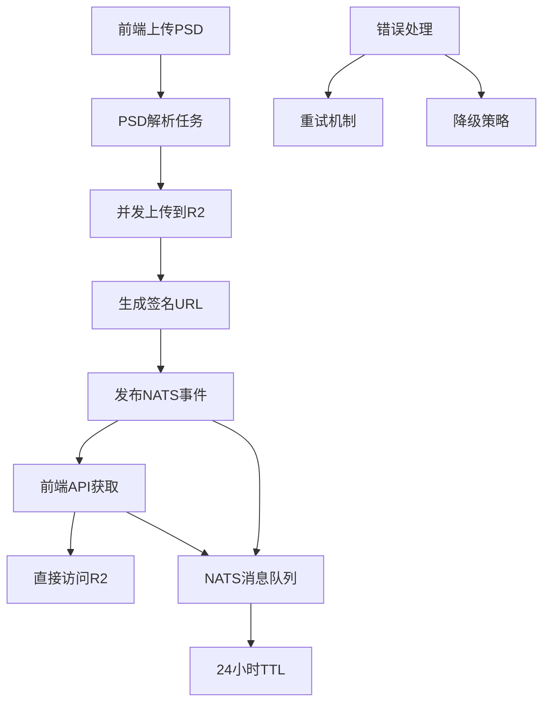

# 设计文档

## 概述

PSD 图层预览功能通过直接 R2 存储访问为前端提供快速、可靠的图层预览能力。系统采用事件驱动架构，使用 NATS 消息队列管理临时预览数据，实现高性能的图层预览服务。

## 架构

### 整体架构图



### 数据流程

1. **上传阶段**: 前端上传 PSD → OSS 存储 → 触发解析任务
2. **处理阶段**: 解析 PSD → 导出图层 PNG → 并发上传到 R2
3. **事件阶段**: 生成签名 URL → 发布 NATS 事件 → 24小时 TTL
4. **访问阶段**: 前端 API 查询 → NATS 获取 URL → 直接访问 R2

## 组件和接口

### 核心组件

#### 1. PSD 解析器 (Parser)
- **位置**: `features/image_generator/services/parser/tasks.py`
- **职责**: PSD 文件解析、图层导出、R2 上传
- **关键方法**:
  - `async_parse_and_export_psd()`: 本地文件解析
  - `async_parse_and_export_psd_from_oss()`: OSS 文件解析

#### 2. R2 上传服务
- **实现**: 集成在解析任务中
- **特性**: 
  - 10 线程并发上传
  - 支持公开域名和签名 URL 两种模式
  - 7 天 URL 有效期

#### 3. NATS 事件系统
- **事件主题**: `events.psd.layers.preview.ready`
- **TTL**: 24 小时自动过期
- **数据模型**: `PSDLayersPreviewReadyEvent`

#### 4. 前端 API 路由
- **位置**: `features/image_generator/routers/psd_upload_oss.py`
- **端点**:
  - `GET /tasks/{task_id}/layers-preview`: 获取图层预览
  - `GET /tasks/{task_id}/layers-preview/status`: 检查预览状态

### 接口定义

#### R2 上传接口
```python
def upload_layer_to_r2(layer_info, file_path, task_id) -> dict:
    """上传单个图层到 R2 存储
    
    Returns:
        {
            'layer_index': int,
            'name': str,
            'url': str,  # R2 访问 URL
            'bbox': dict,
            'file_size': int,
            'uploaded_at': str
        }
    """
```

#### NATS 事件接口
```python
class PSDLayersPreviewReadyEvent(BaseModel):
    """图层预览就绪事件"""
    task_id: str
    filename: str
    layers_count: int
    layers_preview: List[Dict[str, Any]]
    expires_at: str
    total_size: int
```

#### 前端 API 接口
```python
# GET /tasks/{task_id}/layers-preview
{
    "task_id": "uuid",
    "filename": "example.psd",
    "layers_count": 7,
    "layers_preview": [
        {
            "layer_index": 0,
            "name": "背景",
            "url": "https://r2-domain.com/path/layer_0.png?signature=...",
            "bbox": {"x1": 0, "y1": 0, "width": 5000, "height": 5000},
            "file_size": 111885
        }
    ],
    "expires_at": "2025-10-24T12:00:00Z",
    "total_size": 1024000
}
```

## 数据模型

### 图层预览数据结构
```python
LayerPreview = {
    "layer_index": int,      # 图层索引
    "name": str,             # 图层名称
    "url": str,              # R2 访问 URL
    "bbox": {                # 边界框信息（前端兼容格式）
        "x1": int,           # 左上角 X 坐标
        "y1": int,           # 左上角 Y 坐标
        "width": int,        # 宽度
        "height": int,       # 高度
        "x2": int,           # 右下角 X 坐标 (x1 + width)
        "y2": int            # 右下角 Y 坐标 (y1 + height)
    },
    "file_size": int         # 文件大小（字节）
}
```

### bbox 数据格式转换

#### 后端内部格式（解析器输出）
```python
# psd_parser.py 输出格式
bbox = (left, top, width, height)  # 元组格式
```

#### 前端期望格式
```javascript
// PsdCanvasPreview.vue 期望格式
bbox = {
    x1: number,      // 左上角 X
    y1: number,      // 左上角 Y
    width: number,   // 宽度
    height: number,  // 高度
    x2: number,      // 右下角 X (用于计算画布尺寸)
    y2: number       // 右下角 Y (用于计算画布尺寸)
}
```

#### 转换函数设计
```python
def normalize_bbox(bbox: Union[tuple, list, dict]) -> dict:
    """标准化 bbox 格式为前端兼容格式
    
    Args:
        bbox: 可以是元组 (left, top, width, height)、
              列表 [left, top, width, height]、
              或字典 {"x1": ..., "y1": ..., ...}
    
    Returns:
        标准化的字典格式，包含 x1, y1, width, height, x2, y2
    """
    if isinstance(bbox, (tuple, list)) and len(bbox) == 4:
        left, top, width, height = bbox
        return {
            "x1": int(left),
            "y1": int(top),
            "width": int(width),
            "height": int(height),
            "x2": int(left + width),
            "y2": int(top + height)
        }
    elif isinstance(bbox, dict):
        # 如果已经是字典格式，确保包含所有必需字段
        x1 = bbox.get("x1", bbox.get("left", 0))
        y1 = bbox.get("y1", bbox.get("top", 0))
        width = bbox.get("width", 0)
        height = bbox.get("height", 0)
        return {
            "x1": int(x1),
            "y1": int(y1),
            "width": int(width),
            "height": int(height),
            "x2": int(x1 + width),
            "y2": int(y1 + height)
        }
    else:
        # 默认值
        return {
            "x1": 0,
            "y1": 0,
            "width": 0,
            "height": 0,
            "x2": 0,
            "y2": 0
        }
```

### NATS 消息结构
```python
NATSMessage = {
    "subject": "events.psd.layers.preview.ready",
    "data": PSDLayersPreviewReadyEvent,
    "headers": {
        "ttl": "86400",      # 24小时 TTL
        "task_id": str,
        "timestamp": str
    }
}
```

### R2 存储路径规范
```
psd_exports/{task_id}/layer_{layer_index}.png
```

## bbox 格式问题分析和解决方案

### 问题根源

#### 当前数据流
```
PSD 解析器 → 元组格式 (left, top, width, height)
    ↓
预览事件发布 → 直接传递原始格式
    ↓
NATS JetStream → 存储原始格式
    ↓
API 端点返回 → 直接返回原始格式
    ↓
前端接收 → 期望对象格式 {x1, y1, width, height, x2, y2}
    ↓
渲染失败 ❌
```

#### 问题表现
1. **前端无法访问 bbox 属性**: `layer.bbox.x1` 返回 `undefined`
2. **图层位置计算错误**: 使用元组索引 `bbox[0]` 导致逻辑混乱
3. **画布尺寸计算失败**: 缺少 `x2`、`y2` 字段导致画布尺寸为 0

### 解决方案设计

#### 方案选择
**选择方案 2: 在事件发布时统一转换**

**优点**:
- 数据在进入 NATS 前就已标准化
- API 端点无需额外处理
- 前端直接使用，无需转换
- 便于未来维护和扩展

**缺点**:
- 需要修改事件发布逻辑
- 需要确保所有发布点都使用转换函数

#### 实施位置

**主要修改点**:
1. **`services/preview/utils.py`** (新建)
   - 创建 `normalize_bbox()` 工具函数
   - 提供统一的格式转换逻辑

2. **`services/preview/tasks.py`**
   - 在 `publish_layers_preview_ready()` 中调用转换函数
   - 确保发布到 NATS 的数据已标准化

3. **`routers/psd_upload_oss.py`**
   - 在 `/result` 端点添加兜底转换
   - 处理历史数据的兼容性

#### 数据转换流程
```python
# 1. 解析器输出（不变）
bbox = (100, 200, 500, 300)  # (left, top, width, height)

# 2. 事件发布前转换
from services.preview.utils import normalize_bbox
normalized_bbox = normalize_bbox(bbox)
# {
#     "x1": 100,
#     "y1": 200,
#     "width": 500,
#     "height": 300,
#     "x2": 600,   # 100 + 500
#     "y2": 500    # 200 + 300
# }

# 3. 发布到 NATS
layer_info = {
    "layer_index": 0,
    "name": "背景",
    "url": "https://...",
    "bbox": normalized_bbox,  # ← 已标准化
    "file_size": 12345
}

# 4. 前端直接使用
// layer.bbox.x1 ✅
// layer.bbox.y1 ✅
// layer.bbox.width ✅
// layer.bbox.x2 ✅
```

### 兼容性考虑

#### 历史数据处理
```python
# API 端点添加兜底转换
def get_psd_task_result(task_id):
    data = await get_from_jetstream(task_id)
    
    # 确保所有 bbox 都是标准格式
    for layer in data.get("layers_preview", []):
        layer["bbox"] = normalize_bbox(layer["bbox"])
    
    return data
```

#### 渐进式迁移
1. **阶段 1**: 添加转换函数，不影响现有功能
2. **阶段 2**: 在事件发布时应用转换
3. **阶段 3**: 在 API 端点添加兜底转换
4. **阶段 4**: 验证前端渲染正常

### 测试验证

#### 单元测试
```python
def test_normalize_bbox_from_tuple():
    bbox = (100, 200, 500, 300)
    result = normalize_bbox(bbox)
    assert result["x1"] == 100
    assert result["y1"] == 200
    assert result["width"] == 500
    assert result["height"] == 300
    assert result["x2"] == 600
    assert result["y2"] == 500

def test_normalize_bbox_from_dict():
    bbox = {"x1": 100, "y1": 200, "width": 500, "height": 300}
    result = normalize_bbox(bbox)
    assert result["x2"] == 600
    assert result["y2"] == 500
```

#### 集成测试
```python
async def test_preview_bbox_format():
    # 上传 PSD
    task_id = await upload_psd(test_file)
    
    # 等待处理完成
    await wait_for_completion(task_id)
    
    # 获取预览数据
    preview = await get_layers_preview(task_id)
    
    # 验证 bbox 格式
    for layer in preview["layers_preview"]:
        bbox = layer["bbox"]
        assert isinstance(bbox, dict)
        assert "x1" in bbox
        assert "y1" in bbox
        assert "width" in bbox
        assert "height" in bbox
        assert "x2" in bbox
        assert "y2" in bbox
        assert bbox["x2"] == bbox["x1"] + bbox["width"]
        assert bbox["y2"] == bbox["y1"] + bbox["height"]
```

## 错误处理

### 错误分类

#### 1. R2 上传错误
- **场景**: 网络问题、存储配额、权限问题
- **处理**: 记录错误但继续处理其他图层
- **恢复**: 部分成功的图层仍可预览

#### 2. NATS 事件错误
- **场景**: NATS 服务不可用、消息发布失败
- **处理**: 降级到数据库存储
- **恢复**: 提供备用查询接口

#### 3. URL 过期错误
- **场景**: 签名 URL 超过 7 天有效期
- **处理**: 返回明确错误信息
- **恢复**: 建议用户重新上传 PSD

#### 4. 前端 API 错误
- **场景**: 任务不存在、预览数据缺失
- **处理**: 返回适当的 HTTP 状态码
- **恢复**: 提供操作建议

### 错误处理策略

#### 重试机制
```python
# R2 上传重试（指数退避）
max_retries = 3
backoff_factor = 2
retry_delays = [1, 2, 4]  # 秒

# NATS 事件重试
event_retry_count = 3
event_retry_delay = 1  # 秒
```

#### 降级策略
1. **NATS 不可用** → 数据库查询
2. **R2 访问失败** → 本地文件服务
3. **签名 URL 过期** → 重新生成 URL
4. **部分图层失败** → 返回可用图层

#### 监控和告警
- R2 上传成功率监控
- NATS 消息处理延迟监控
- API 响应时间监控
- 存储空间使用监控

## 测试策略

### 单元测试

#### 1. R2 上传功能测试
```python
def test_upload_layer_to_r2():
    """测试单个图层上传到 R2"""
    # 模拟图层数据
    # 验证上传成功
    # 检查返回的 URL 格式
```

#### 2. NATS 事件测试
```python
def test_publish_preview_ready_event():
    """测试图层预览就绪事件发布"""
    # 模拟事件数据
    # 验证事件发布成功
    # 检查 TTL 设置
```

#### 3. API 端点测试
```python
def test_get_layers_preview():
    """测试获取图层预览 API"""
    # 模拟 NATS 数据
    # 调用 API 端点
    # 验证响应格式
```

### 集成测试

#### 1. 端到端流程测试
```python
def test_psd_to_preview_workflow():
    """测试完整的 PSD 到预览流程"""
    # 上传 PSD 文件
    # 等待解析完成
    # 验证 R2 文件存在
    # 检查 NATS 事件
    # 调用预览 API
    # 验证前端可访问
```

#### 2. 并发处理测试
```python
def test_concurrent_psd_processing():
    """测试并发 PSD 处理能力"""
    # 同时上传多个 PSD
    # 验证系统稳定性
    # 检查资源使用情况
```

### 性能测试

#### 1. R2 上传性能
- **目标**: 7 个图层 < 1 秒
- **并发**: 10 线程同时上传
- **测试场景**: 不同文件大小、网络条件

#### 2. API 响应性能
- **目标**: 预览 API < 100ms
- **负载**: 100 并发请求
- **测试场景**: NATS 可用/不可用

#### 3. 存储清理性能
- **目标**: 24 小时 TTL 准确性
- **测试**: 过期数据自动清理
- **监控**: 存储空间使用趋势

### 错误场景测试

#### 1. 网络故障测试
- R2 服务不可用
- NATS 连接中断
- 间歇性网络问题

#### 2. 资源限制测试
- 存储空间不足
- 线程池耗尽
- 内存使用过高

#### 3. 数据一致性测试
- 部分图层上传失败
- 事件发布失败
- 并发访问冲突

## 性能优化

### R2 上传优化
- **并发上传**: 使用 ThreadPoolExecutor，10 个工作线程
- **分块上传**: 大文件分块处理（如需要）
- **连接复用**: 复用 HTTP 连接减少开销

### NATS 消息优化
- **批量发布**: 合并相关事件减少网络调用
- **消息压缩**: 大数据载荷压缩传输
- **连接池**: 复用 NATS 连接

### API 响应优化
- **缓存策略**: Redis 缓存热点数据
- **数据分页**: 大量图层分页返回
- **响应压缩**: gzip 压缩 JSON 响应

### 存储优化
- **自动清理**: 定时任务清理过期文件
- **存储分层**: 热数据和冷数据分离
- **CDN 加速**: R2 配合 CDN 提升访问速度

## 安全考虑

### URL 安全
- **签名验证**: 所有 R2 URL 包含签名验证
- **时效控制**: 7 天有效期限制
- **域名限制**: 仅允许配置的域名访问

### 数据安全
- **传输加密**: HTTPS 传输所有数据
- **存储加密**: R2 存储端加密
- **访问控制**: 基于用户权限的访问控制

### 系统安全
- **输入验证**: 严格验证所有输入参数
- **错误处理**: 不泄露敏感系统信息
- **日志审计**: 记录所有关键操作

## 部署配置

### 环境变量
```bash
# R2 存储配置
R2_PUBLIC_DOMAIN=https://your-r2-domain.com
R2_ACCESS_KEY_ID=your_access_key
R2_SECRET_ACCESS_KEY=your_secret_key
R2_BUCKET_NAME=your_bucket

# NATS 配置
NATS_URL=nats://localhost:4222
NATS_TTL_SECONDS=86400

# 性能配置
R2_UPLOAD_THREADS=10
API_RESPONSE_TIMEOUT=30
```

### 基础设施要求
- **R2 存储**: Cloudflare R2 或兼容的 S3 服务
- **NATS 服务**: NATS 2.0+ 支持 TTL 功能
- **Redis 缓存**: 用于 API 响应缓存（可选）
- **监控系统**: Prometheus + Grafana（推荐）

### 扩展性考虑
- **水平扩展**: 支持多实例部署
- **负载均衡**: API 层负载均衡
- **数据分片**: 大规模部署时的数据分片策略