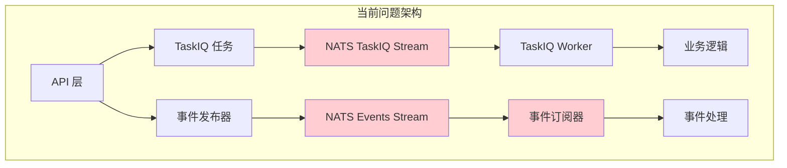

# 设计文档

## 概述

本设计文档详细说明了统一 TaskIQ + NATS 架构的技术实现方案。通过将当前的双重消息系统（TaskIQ 任务队列 + 独立事件系统）整合为单一的、基于 TaskIQ 的统一架构，解决系统复杂性、资源开销和可靠性问题。

## 架构设计

### 当前架构问题



**问题点：**
- 双重 NATS 连接管理
- 两套不同的消息处理机制
- 事件订阅器容易出现消息抢占问题
- 开发者认知负担重

### 目标架构设计

```mermaid
graph TD
    subgraph "统一架构"
        A[API 层] --> B[统一 Broker]
        
        B --> C[TASKS Stream<br/>命令队列]
        B --> D[EVENTS Stream<br/>事件广播]
        
        C --> E[命令任务<br/>@broker.task<br/>shared consumer]
        D --> F[事件任务<br/>@broker.task<br/>unique consumer]
        
        E --> G[业务服务层]
        F --> H[事件处理逻辑]
        
        G --> I[发布完成事件]
        I --> D
    end
    
    style B fill:#c8e6c9
    style C fill:#e3f2fd
    style D fill:#fff8e1
    
    classDef unified fill:#c8e6c9
    classDef command fill:#e3f2fd
    classDef event fill:#fff8e1
```

## 组件设计

### 1. 统一连接管理器 (core/broker.py)

```python
# 重构后的 broker.py 设计
from taskiq import TaskiqEvents
from taskiq_nats import PushBasedJetStreamBroker

# 移除全局 stream_name 和 queue 配置
broker = PushBasedJetStreamBroker(
    servers=[settings.NATS_URL],
    # 不再设置全局 stream_name 和 queue
)

@broker.on_event(TaskiqEvents.WORKER_STARTUP)
async def setup_streams(state):
    """Worker 启动时自动创建和确保 Stream 存在"""
    js = broker.js
    
    # 确保 TASKS Stream 存在
    await ensure_stream(js, "TASKS", ["tasks.>"])
    
    # 确保 EVENTS Stream 存在  
    await ensure_stream(js, "EVENTS", ["events.>"])

async def ensure_stream(js, stream_name: str, subjects: list):
    """确保指定的 Stream 存在"""
    try:
        await js.stream_info(stream_name)
    except:
        await js.add_stream(StreamConfig(
            name=stream_name,
            subjects=subjects,
            retention=RetentionPolicy.LIMITS,
            max_age=3600,  # 1小时
            storage="file",
        ))
```

### 2. 命令任务模式 (1:1 执行)

```python
# 命令任务：工作队列模式
@broker.task(
    stream="TASKS",
    durable_name="psd_parser_pool",  # 共享消费者名称
    subject="tasks.psd.parse"
)
async def task_parse_psd(oss_key: str, task_id: str) -> dict:
    """PSD 解析命令任务 - 只有一个 worker 执行"""
    try:
        # 调用业务服务层
        result = await psd_service.parse_psd(oss_key)
        
        # 触发后续工作流
        await notify_psd_parse_completed.kiq(
            task_id=task_id,
            layers_info=result.layers
        )
        
        return result
        
    except Exception as e:
        await notify_psd_parse_failed.kiq(
            task_id=task_id,
            error=str(e)
        )
        raise
```

### 3. 事件任务模式 (1:N 广播)

```python
# 事件任务：广播模式
@broker.task(
    stream="EVENTS",
    durable_name="observer_db_updater_v1",  # 唯一消费者名称
    subject="events.psd.parse.completed"
)
async def on_psd_parse_completed(raw_payload: dict) -> None:
    """PSD 解析完成事件处理 - 所有监听器都接收"""
    
    # 版本兼容性检查
    version = raw_payload.get("event_version", "1.0")
    if not is_version_compatible(version, "1.0"):
        logger.warning(f"不支持的事件版本: {version}")
        return
    
    try:
        # 解析事件数据
        event = PSDParseCompletedEvent(**raw_payload)
        
        # 更新数据库状态
        async with get_session_context() as db:
            await update_task_status(db, event.task_id, "completed")
            await db.commit()
            
    except Exception as e:
        logger.error(f"事件处理失败: {e}")

# 另一个独立的事件监听器
@broker.task(
    stream="EVENTS", 
    durable_name="observer_background_generator_v1",  # 不同的唯一名称
    subject="events.psd.parse.completed"
)
async def on_psd_parse_completed_bg(raw_payload: dict) -> None:
    """同一事件的另一个处理器 - 生成背景图"""
    event = PSDParseCompletedEvent(**raw_payload)
    await task_generate_backgrounds.kiq(
        task_id=event.task_id,
        layers_info=event.layers_info
    )
```

### 4. 统一事件发布器

```python
# 重构后的 events/publisher.py
from core.broker import broker

async def publish_event(event_name: str, payload: dict) -> None:
    """使用统一 broker 发布事件"""
    subject = f"events.{event_name}"
    
    # 添加版本信息
    payload["event_version"] = payload.get("event_version", "1.0")
    payload["timestamp"] = datetime.utcnow().isoformat()
    
    # 使用共享的 broker.js 连接
    js = broker.js
    encoded = json.dumps(payload).encode()
    
    try:
        ack = await js.publish(subject, encoded)
        logger.debug(f"事件发布成功: {subject} → seq={ack.seq}")
    except Exception as e:
        logger.error(f"事件发布失败: {subject}, error={e}")
        raise
```

## 数据模型

### 1. 基础事件模型

```python
# events/schemas.py 重构
from pydantic import BaseModel, Field
from datetime import datetime

class BaseEvent(BaseModel):
    """所有事件的基类"""
    event_version: str = Field(default="1.0", description="事件版本")
    timestamp: datetime = Field(default_factory=datetime.utcnow, description="事件时间戳")
    event_id: str = Field(default_factory=lambda: str(uuid.uuid4()), description="事件唯一ID")

class PSDParseCompletedEvent(BaseEvent):
    """PSD 解析完成事件"""
    task_id: str = Field(..., description="任务ID")
    filename: str = Field(..., description="PSD文件名")
    layers_info: List[Dict[str, Any]] = Field(..., description="图层信息")
    processing_time: float = Field(..., description="处理耗时（秒）")
```

### 2. 任务配置模型

```python
# 任务配置数据结构
@dataclass
class TaskConfig:
    """任务配置"""
    stream: str  # "TASKS" 或 "EVENTS"
    durable_name: str  # 消费者名称
    subject: str  # NATS 主题
    ack_wait: int = 300  # 确认等待时间
    max_deliver: int = 3  # 最大重试次数

# 命令任务配置
COMMAND_TASKS = {
    "psd_parser": TaskConfig(
        stream="TASKS",
        durable_name="psd_parser_pool",
        subject="tasks.psd.parse"
    ),
    "background_generator": TaskConfig(
        stream="TASKS", 
        durable_name="bg_generator_pool",
        subject="tasks.background.generate"
    )
}

# 事件任务配置
EVENT_TASKS = {
    "db_updater": TaskConfig(
        stream="EVENTS",
        durable_name="observer_db_updater_v1",
        subject="events.psd.parse.completed"
    ),
    "bg_trigger": TaskConfig(
        stream="EVENTS",
        durable_name="observer_bg_trigger_v1", 
        subject="events.psd.parse.completed"
    )
}
```

## 错误处理

### 1. 命令任务错误处理

```python
@broker.task(stream="TASKS", durable_name="psd_parser_pool")
async def task_parse_psd(oss_key: str, task_id: str) -> dict:
    try:
        # 业务逻辑
        result = await psd_service.parse_psd(oss_key)
        
        # 成功事件
        await publish_event("psd.parse.completed", {
            "task_id": task_id,
            "result": result
        })
        
        return result
        
    except ValidationError as e:
        # 参数错误 - 不重试
        await publish_event("psd.parse.failed", {
            "task_id": task_id,
            "error_type": "validation",
            "error": str(e)
        })
        raise
        
    except (OSError, NetworkError) as e:
        # 可重试错误
        logger.warning(f"可重试错误: {e}")
        raise  # TaskIQ 会自动重试
        
    except Exception as e:
        # 未知错误
        await publish_event("psd.parse.failed", {
            "task_id": task_id,
            "error_type": "unknown",
            "error": str(e)
        })
        raise
```

### 2. 事件任务错误处理

```python
@broker.task(stream="EVENTS", durable_name="observer_db_updater_v1")
async def on_psd_parse_completed(raw_payload: dict) -> None:
    try:
        # 版本检查
        version = raw_payload.get("event_version", "1.0")
        if not is_version_compatible(version, "1.0"):
            logger.warning(f"跳过不兼容版本: {version}")
            return  # 不抛异常，避免重试
        
        # 事件处理
        event = PSDParseCompletedEvent(**raw_payload)
        await update_database(event)
        
    except ValidationError as e:
        # 数据格式错误 - 记录但不重试
        logger.error(f"事件数据格式错误: {e}")
        return
        
    except DatabaseError as e:
        # 数据库错误 - 可重试
        logger.warning(f"数据库错误，将重试: {e}")
        raise
        
    except Exception as e:
        # 其他错误 - 记录并跳过
        logger.error(f"事件处理异常: {e}")
        return
```

## 测试策略

### 1. 单元测试重点

- **业务服务层测试**: 独立测试 `features/*/services/` 中的业务逻辑
- **事件模型测试**: 验证 Pydantic 模型的序列化/反序列化
- **版本兼容性测试**: 测试不同版本事件的处理逻辑

### 2. 集成测试重点

- **工作流测试**: 测试命令任务 → 事件发布 → 事件处理的完整流程
- **错误恢复测试**: 测试任务失败和重试机制
- **并发测试**: 验证多个 worker 的负载均衡

### 3. 迁移测试

- **兼容性测试**: 确保新旧系统可以并行运行
- **数据一致性测试**: 验证迁移过程中数据不丢失
- **性能对比测试**: 对比新旧架构的性能差异

## 部署考虑

### 1. 分阶段部署

1. **阶段 1**: 部署新的统一 broker，保持旧系统运行
2. **阶段 2**: 逐个模块迁移到新架构
3. **阶段 3**: 验证功能正常后移除旧系统组件

### 2. 监控指标

- **任务执行指标**: 成功率、延迟、吞吐量
- **事件处理指标**: 事件发布/消费速率、处理延迟
- **系统资源指标**: NATS 连接数、内存使用、CPU 使用

### 3. 回滚策略

- 保留旧系统代码分支
- 数据库迁移脚本支持回滚
- 配置开关支持快速切换到旧架构